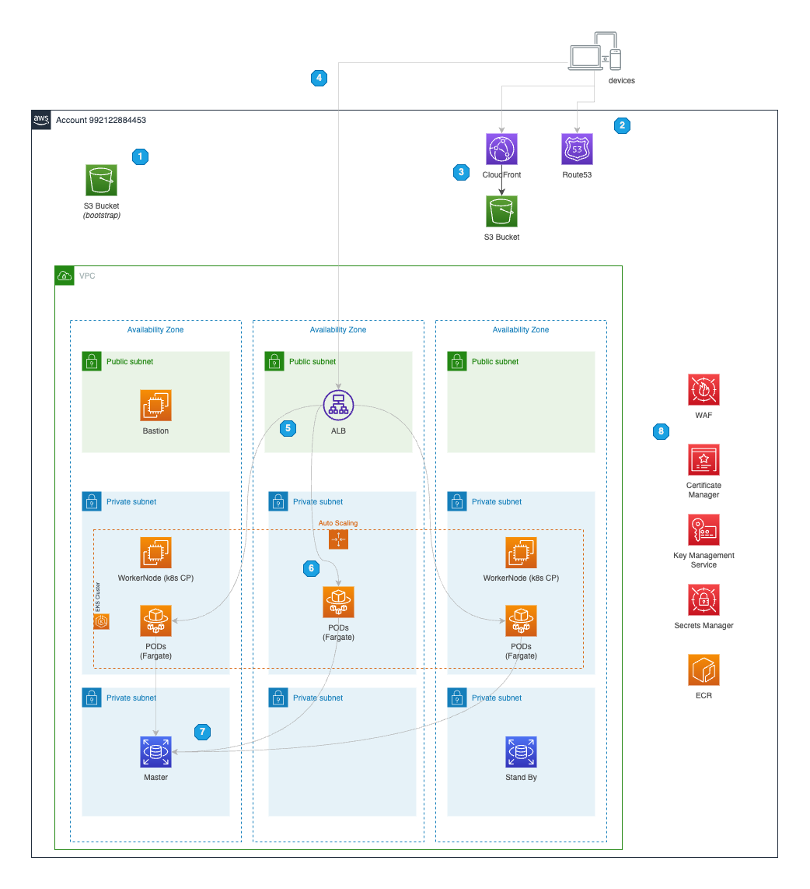

# Jumia customers phone number validator

## Solution Overview
Terraform to create infrastructure to jumia-phone-validator application.

The solution utilizes following services:


### Requirements

- [aws cli](https://docs.aws.amazon.com/cli/latest/userguide/getting-started-install.html)
- [terraform](https://developer.hashicorp.com/terraform/tutorials/aws-get-started/install-cli)
- [eksctl](https://github.com/terraform-aws-modules/terraform-aws-ec2-instance/tree/master/examples/complete)
- [kubectl](https://github.com/terraform-aws-modules/terraform-aws-ec2-instance/tree/master/examples/volume-attachment)
- [jq](https://github.com/terraform-aws-modules/terraform-aws-ec2-instance/tree/master/examples/volume-attachment)
- [docker](https://docs.docker.com/engine/install/)
- [npm](https://nodejs.org/en/download/)
- [psql](https://www.postgresql.org/download/)


### Boostraping bucket and dynamodb table for terraform state/lock with `aws cli`

```shell
# Creating bucket
aws s3api create-bucket --bucket tfstate-jumia-phone-validator --region eu-west-1 --create-bucket-configuration LocationConstraint=eu-west-1

# Enabling encryption
aws s3api put-bucket-encryption --bucket tfstate-jumia-phone-validator --server-side-encryption-configuration "{\"Rules\": [{\"ApplyServerSideEncryptionByDefault\":{\"SSEAlgorithm\": \"AES256\"}}]}"

# Creating dynamodb
aws dynamodb create-table --table-name tfstate-jumia-phone-validator-prd --attribute-definition AttributeName=LockID,AttributeType=S --key-schema AttributeName=LockID,KeyType=HASH --provisioned-throughput ReadCapacityUnits=5,WriteCapacityUnits=5 --region eu-west-1
```

### Change values accordinly within `main.tf` file

```hcl
terraform {
  backend "s3" {
    bucket          = "tfstate-jumia-phone-validator-prd"
    key             = "infra/terraform.tfstate"
    region          = "eu-west-1"
    dynamodb_table  = "tfstate-jumia-phone-validator-prd"
  }
}

locals {
  # Generic info
  name    = "jumia_challenge"
  region  = "eu-west-1"
  domain  = "jumia-devops-challenge.eu"
  dns_zone_id = "Z0524081XI5U8NS279SJ"

  bootstrap_bucket = "tfstate-jumia-phone-validator-prd"

  tags = {
    Owner       = "ffonseca"
    Service     = "jumia_phone_validator"
    Product     = "devops_challenge"
    Environment = "prd"
  }

  # K8s configs
  product_name = "${replace(basename(local.tags.Product), "_", "-")}"
  service_name = "${replace(basename(local.tags.Service), "_", "-")}"
}
```

### Create an environment variable with database password and run terraform init/apply

```shell
# Password with Felipe Fonseca
export TF_var_db_password=`secret`

# Terraform init
terraform init

# And terraform apply
terraform apply
```

### Compiling backend, tagging accordinly and pushing to ECR

```shell
# Compiling backend, tagging accordinly and pushing to ECR
docker run -it --rm --name my-maven-project -v "$(pwd)"/../validator-backend:/usr/src/mymaven -w /usr/src/mymaven maven:3.3-jdk-8 mvn clean install

# Building ()
docker buildx build --platform linux/amd64 . -t validator-backend-image -f "$(pwd)"/../validator-backend/Dockerfile

# Check the IMAGE ID and use it tagging the image wih ECR push pattern
docker image ls | grep validator-backend-image
docker tag ${CONTAINER_ID} 992122884453.dkr.ecr.eu-west-1.amazonaws.com/jumia-phone-validator

# Login on ECR with STS
aws ecr get-login-password --region eu-west-1 | docker login --username AWS --password-stdin 992122884453.dkr.ecr.eu-west-1.amazonaws.com

# PUSH!
docker push 992122884453.dkr.ecr.eu-west-1.amazonaws.com/jumia-phone-validator
```

### Building and pushing static content to bucket

```shell
# Npm steps
npm --prefix "$(pwd)"/../validator-frontend install
npm --prefix "$(pwd)"/../validator-frontend run build

# Static content
aws s3 cp --recursive "$(pwd)"/../validator-frontend/build/. s3://jumia-phone-validator-frontend-prd/
```

### Building and pushing static content to bucket

```shell
# SQL data load
psql -h rds.jumia-devops-challenge.eu -U jumia_phone_validator_dba # will ask for password
>\i ../database/sample.sql
```

### ToDo
1. API Gateway and Internal ELB
2. Monitoring / Cloudwatch Dashboards / Notifications
3. Backups